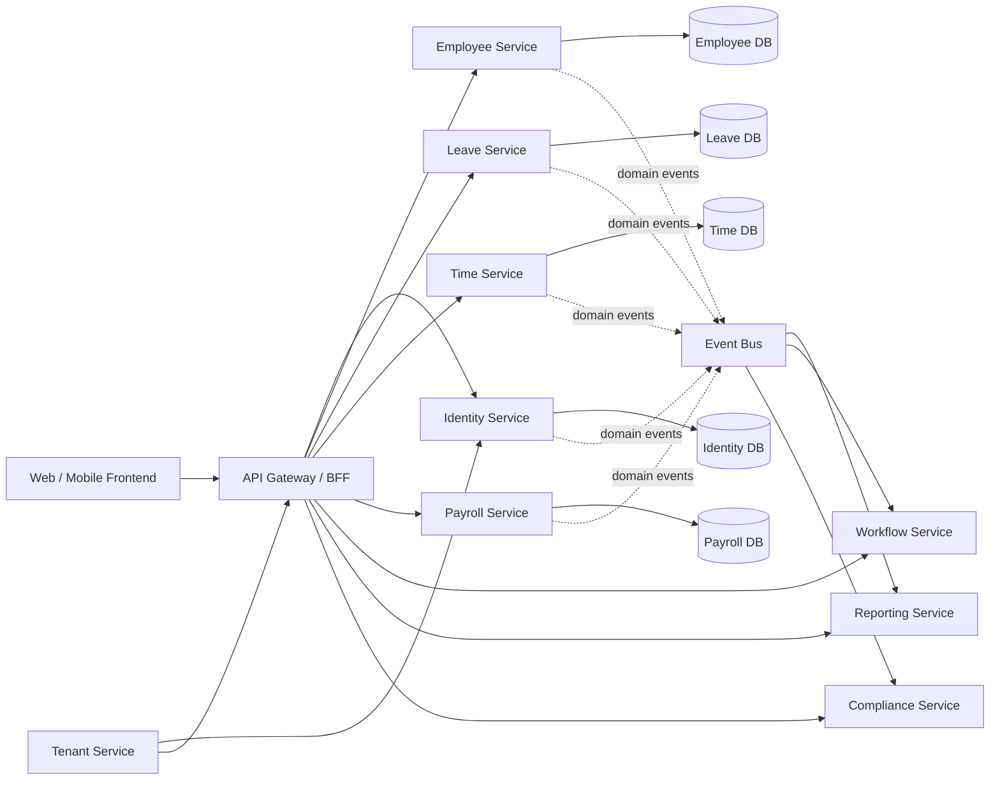
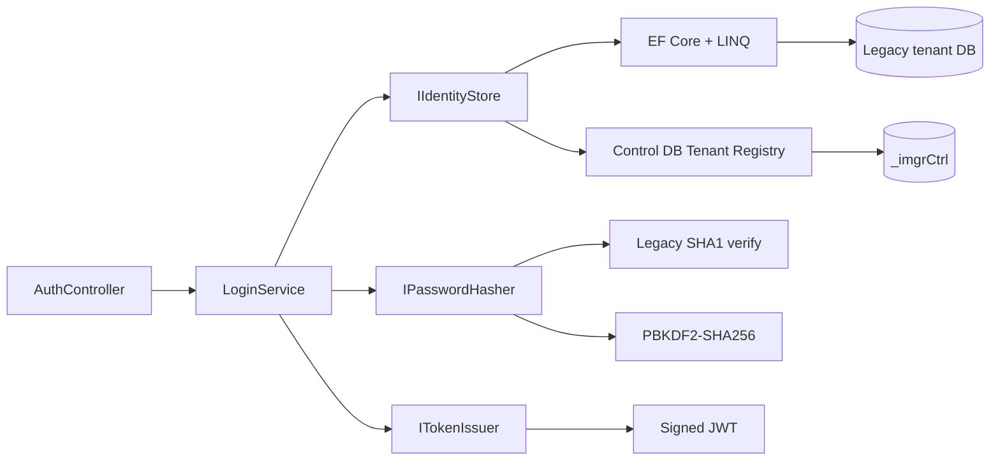

# 目标微服务架构与迁移路线

## 1. 目标形态

核心规则：

- 每个服务拥有自己的数据模型和发布周期。
- 服务之间不直接查询对方数据库；同步请求走 API，状态传播走事件。
- 报表不再跨多个生产库即时 Join，而是订阅事件建立只读报表模型。
- 共享包只承载技术能力和版本化消息契约，不共享 Employee、Payroll 等业务实体。
- 外部入口统一 HTTPS、JWT、trace/correlation id，并在网关实施全局限流。

## 2. Identity Service 当前结构

依赖方向是 `API -> Infrastructure -> Application -> Domain`。Application 只依赖接口，因此登录规则可以在没有 SQL Server 和 HTTP 的情况下进行单元测试。

当前 REST 契约：

| Method | Path | Auth | 说明 |
|---|---|---|---|
| POST | `/api/auth/login` | Anonymous + rate limit | 租户、用户名、密码登录 |
| GET | `/api/auth/User` | Bearer | 返回 token 中当前身份 |
| GET | `/health/live` | Anonymous | 进程存活检查 |
| GET | `/swagger` | 当前开发期开放 | OpenAPI UI，生产应受限 |

## 3. 数据与租户策略

迁移期间采用两阶段数据策略：

1. **兼容阶段**：Identity Infrastructure 通过 EF Core 映射旧租户库的 `Users`、`SystemParameter`、`LoginAudit`。这让 API 可以先上线，但这些表仍是共享遗留数据。
2. **独占阶段**：创建 Identity 数据库和凭据表，迁移用户/组/权限；通过 outbox 事件向其他服务发布 `UserActivated`、`UserLocked`、`PermissionChanged` 等事实。

当前 Identity Infrastructure 已实现旧系统 Tenant Registry 防腐层：

- 输入规范化后的 `tenantCode`。
- 查询旧 SaaS 主库 `CompanyDatabase` 与 `DatabaseServer`。
- 使用与旧 `DBAESEncryptStringFieldAttribute` 兼容的 AES-CBC 算法解密服务器、数据库名和凭据。
- 只向 Identity Store 返回租户代码与连接字符串，不把控制库实体泄漏给 Application/Domain。
- `_imgrCtrl` 未配置时才使用静态 `Tenants` 字典作为非 SaaS 回退。

当前适配器随 Identity Service 部署。服务数量增加后，应把控制库访问提取到 Tenant Service，并增加短时缓存、失效和租户解析审计，避免每个业务服务复制控制库模型与解密逻辑。

## 4. 服务切分顺序

| 阶段 | 交付 | 关键退出条件 |
|---|---|---|
| 0. 特征测试 | 冻结旧登录、薪资、假期关键行为 | 有可重复的基线数据和预期结果 |
| 1. Identity | 当前 API、Tenant Registry、用户/组/权限、refresh token | 新前端只通过 Identity 登录；旧通用密码已删除 |
| 2. Employee | 员工与组织查询先行，再迁移写入 | Employee API 成为员工主数据唯一写入口 |
| 3. Leave / Time | 假期余额、申请；考勤与排班 | 明确跨域事件和结算时点，旧页面逐项下线 |
| 4. Payroll | 试算、确认、调整、付款 | 新旧同批次结果逐项对账通过，具备幂等和回滚策略 |
| 5. Compliance / Reporting | MPF/税务、事件驱动报表 | 报表不再直接跨服务库查询 |
| 6. 收尾 | 数据库独占、删除防腐层 | 旧 Web Forms 与共享 DataAccess 不再承载业务流量 |

Payroll 风险最高，必须后迁。优先迁移“读接口”和低耦合写流程，让 API 边界稳定后再移动计算核心。

## 5. 下一开发增量

建议紧接当前骨架完成：

1. 接一份脱敏租户数据库，运行 `identity-preflight.sql` 并做真实 EF 映射验证。
2. 增加 API 集成测试：SQL Server 临时库、成功/锁定/审计事务、Problem Details。
3. 实现用户、用户组、功能权限读取，把权限以精简 claims 或授权策略暴露。
4. 增加 refresh token 轮换、撤销、密码修改和审计；强制改密用户仅允许访问改密端点。
5. 为 Tenant Registry 增加短时缓存、连接可用性健康检查，并逐步提取为独立 Tenant Service。
6. 加入 OpenTelemetry、集中日志、分布式限流和 secret manager。
7. 确定第一个前端切片，只做 Login + 当前用户，不直接复刻整套 Web Forms。
